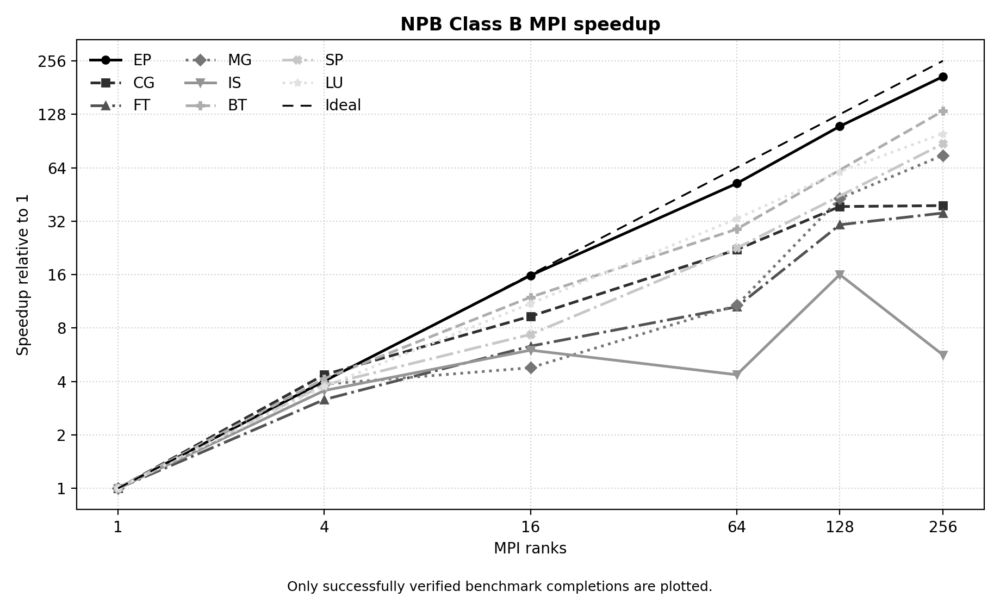
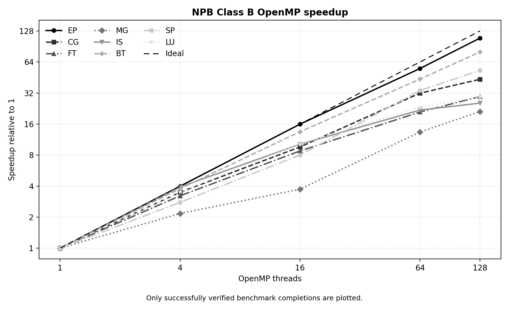
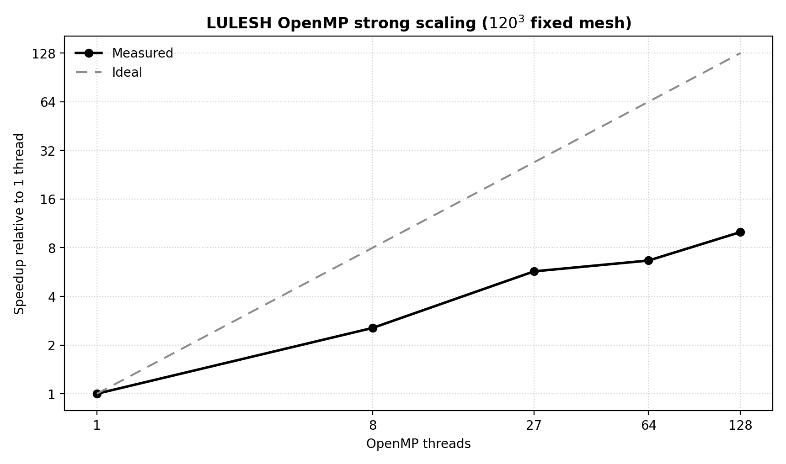
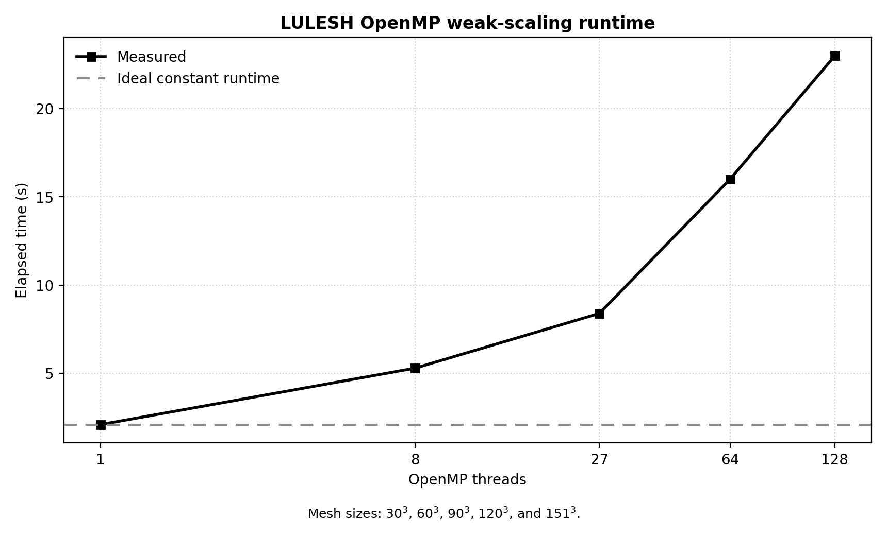
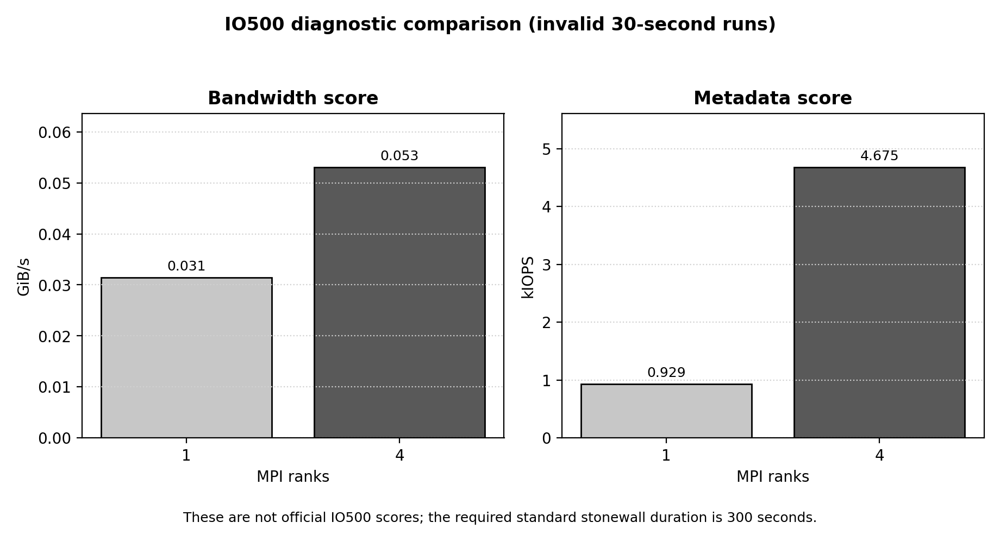

# MOGON KI HPC Benchmark Runs

This repository contains Slurm scripts, configuration files, and raw output from CPU benchmark experiments performed on the MOGON KI high-performance computing system in July 2026.

The work covers three benchmark suites:

- NAS Parallel Benchmarks (NPB) using MPI and OpenMP
- Livermore Unstructured Lagrangian Explicit Shock Hydrodynamics (LULESH) using MPI and OpenMP
- IO500 using MPI and the Lustre parallel file system

The repository is an experimental record. Raw outputs are retained even when a run was incomplete or invalid so that the results can be inspected and the experiments can be corrected and repeated.

## Repository contents

```text
.
├── analysis/
│   └── generate_graphs.py
├── assets/
│   └── graphs/
├── npb/
│   ├── mpi/
│   │   ├── scripts/
│   │   └── results/
│   └── openmp/
│       ├── scripts/
│       └── results/
├── lulesh/
│   ├── mpi/
│   │   ├── scripts/
│   │   └── results/
│   └── openmp/
│       ├── scripts/
│       └── results/
├── io500/
│   ├── build/
│   ├── config/
│   ├── environment/
│   ├── scripts/
│   ├── results/
│   └── summaries/
├── VALIDATION.md
└── SHA256SUMS
```

## Software environment

| Component | Recorded version or setting |
|---|---|
| Scheduler | Slurm |
| Compiler | GCC 13.3.0 |
| MPI | OpenMPI 5.0.3 |
| NPB | NPB 3.4.4 MPI and NPB 3.4 OpenMP |
| LULESH | `lulesh2.0` executable |
| IO500 | `io500-isc26_v2-26-g02091cf254d8` |
| CPU partitions | `ki-smallcpu`, `ki-parallel` |
| IO500 data storage | Lustre |

The exact loaded modules for IO500 are recorded in [`io500/environment/environment.txt`](io500/environment/environment.txt). The IO500 dependency preparation log is available in [`io500/build/prepare.log`](io500/build/prepare.log).

## Experiment matrix

| Benchmark | Parallel model | Experiment sizes |
|---|---|---|
| NPB Class S | MPI | 1 and 4 ranks |
| NPB Classes A, B, C | MPI | 1, 4, 16, 64, 128, and 256 ranks |
| NPB Classes S, A, B, C | OpenMP | 1, 4, 16, 64, and 128 threads |
| LULESH strong scaling | MPI | 1, 8, 27, 64, 125, and 216 requested ranks |
| LULESH weak scaling | MPI | 1, 8, 27, 64, 125, and 216 requested ranks |
| LULESH strong scaling | OpenMP | 1, 8, 27, 64, and 128 threads; fixed mesh `120^3` |
| LULESH weak scaling | OpenMP | 1, 8, 27, 64, and 128 threads; meshes `30^3`, `60^3`, `90^3`, `120^3`, and `151^3` |
| IO500 debug | MPI | 4 ranks; 1-second stonewall |
| IO500 comparison | MPI | 1, 4, and 8 ranks; 30-second stonewall |

## Result overview

### NPB

The NPB scripts execute EP, CG, FT, MG, IS, BT, SP, and LU. Most recorded runs completed with successful NPB verification. BT and SP were intentionally skipped at 128 MPI ranks because these programs require a square process count.

Some NPB artifacts are partial:

- Class A at 256 MPI ranks has no completed CG result.
- Class C at 256 MPI ranks has no completed MG result.
- Class C with one OpenMP thread was attempted twice; the available files do not contain successful FT or MG completions.

The graphs below use Class B because it has complete, successfully verified measurements across the recorded resource counts. Speedup is calculated as `T1/Tp`, where `T1` is the one-rank or one-thread runtime and `Tp` is the runtime at the plotted resource count. Missing points, such as BT and SP at 128 MPI ranks, are not interpolated.





See [`VALIDATION.md`](VALIDATION.md) for the complete status assessment.

### LULESH OpenMP

All ten recorded OpenMP runs completed 100 iterations. The strong-scaling results used a fixed `120^3` mesh.

| Threads | Elapsed time (s) | FOM (zones/s) | Approximate speedup |
|---:|---:|---:|---:|
| 1 | 120 | 1,445.76 | 1.00 |
| 8 | 47 | 3,705.88 | 2.55 |
| 27 | 21 | 8,373.07 | 5.71 |
| 64 | 18 | 9,865.18 | 6.67 |
| 128 | 12 | 14,209.72 | 10.00 |



The weak-scaling runs increased the mesh so that the number of elements per thread remained approximately constant.

| Threads | Mesh | Elapsed time (s) | FOM (zones/s) |
|---:|---:|---:|---:|
| 1 | `30^3` | 2.1 | 1,293.97 |
| 8 | `60^3` | 5.3 | 4,092.03 |
| 27 | `90^3` | 8.4 | 8,634.91 |
| 64 | `120^3` | 16 | 10,541.25 |
| 128 | `151^3` | 23 | 15,232.69 |



### LULESH MPI

The files under [`lulesh/mpi/results`](lulesh/mpi/results) must not be interpreted as MPI scaling results. A file submitted with 216 ranks, for example, contains 216 separate LULESH executions and every execution reports `MPI tasks = 1`. This is consistent with a serial or non-MPI executable being launched once per requested Slurm task.

These files are retained as diagnostic evidence. LULESH must be rebuilt with MPI enabled and the MPI experiment must be rerun before distributed scaling conclusions can be made.

### IO500

The 1-rank and 4-rank runs produced result files, but IO500 marks both total scores as invalid because a 30-second stonewall was used instead of the 300 seconds required by the standard run.

| MPI ranks | Bandwidth score (GiB/s) | Metadata score (kIOPS) | Total score | Status |
|---:|---:|---:|---:|---|
| 1 | 0.031404 | 0.928885 | 0.170794 | Invalid test configuration |
| 4 | 0.053014 | 4.674587 | 0.497813 | Invalid test configuration |
| 8 | — | — | — | Incomplete; out-of-memory termination |

These values are useful for debugging and local comparison only. They are not valid official IO500 scores. The 8-rank job was terminated after an out-of-memory event, and its partial files are stored under [`io500/results/8-ranks-incomplete`](io500/results/8-ranks-incomplete).



The IO500 graph intentionally excludes the incomplete 8-rank attempt and labels the 1-rank and 4-rank measurements as invalid 30-second diagnostic runs.

## Reproducing the experiments

The scripts are preserved in the directory arrangement used for documentation. Their relative paths assume that they are run from a `bashfiles` or `scripts` directory inside the corresponding benchmark source tree.

Before submitting any job:

1. Change the Slurm account and partition names if the target system differs from MOGON KI.
2. Confirm that the compiler and MPI module names exist on the target cluster.
3. Build the expected executable paths:
   - NPB: `bin/<benchmark>.<class>.x`
   - LULESH MPI: `build/mpi/lulesh2.0`
   - LULESH OpenMP: `build/openmp/lulesh2.0`
   - IO500: the `io500` executable in the IO500 source directory
4. For IO500, replace `IO500_LUSTRE` with a writable Lustre project path and confirm that the requested data volume is acceptable.

Example submissions:

```bash
# NPB MPI Classes A, B, and C
cd <NPB3.4-MPI>/bashfiles
bash submit_classABC.sh

# LULESH OpenMP strong scaling
cd <LULESH>/bashfiles
bash submit_omp_strong.sh

# IO500 comparison runs
cd <IO500>/scripts
sbatch --ntasks=1 run_io500_compare.sh
sbatch --ntasks=4 run_io500_compare.sh
```

Do not repeat the 8-rank IO500 run without first estimating and requesting sufficient memory. For a standard, valid IO500 result, also change the stonewall duration to 300 seconds and allocate a suitable job time limit.

## Notes on raw artifacts

- Job IDs, compute-node names, cluster usernames, and site-specific filesystem paths are intentionally preserved in the raw output.
- Empty IO500 timestamp files are expected artifacts.
- IO500 `config.ini` files are expanded configurations generated by the benchmark; the smaller `config-orig.ini` files contain the supplied settings.
- The scripts document how these particular experiments were launched. They are not intended as universal cluster configurations.
- The README graphs can be regenerated from the retained raw outputs by running `python analysis/generate_graphs.py` from the repository root. This requires Matplotlib.
- [`SHA256SUMS`](SHA256SUMS) can be used to check that the archived artifacts have not changed.

## Author

Ashutosh Lembhe
